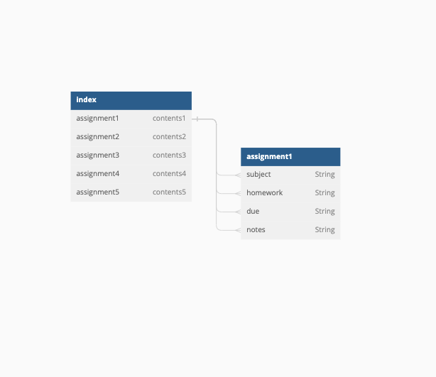

# Assignments - Capstone Project
- Project By: Nicholas Smith
- [Github](https://github.com/nicholasjamessmith/assignments-server)
- [Frontend README](https://github.com/nicholasjamessmith/assignments-frontend/blob/main/README.md)
- [Deployed Site](https://assignments-server-u6nv.onrender.com/assignments)
- Technologies used:
  - Python
  - Flask API
  - Postman
  - Render

## Description
The backend server and API is written in Python using the Flask framwork. The data for this project is stored using a PostgreSQL database via Neon.The data model for each type of post on the site is an 'assignment', where each review includes 'subject', 'homework', 'due', and 'notes', each of which are string values. The site is designed with RESTful routes architecture, giving functionality to the user experience on the frontend.

## List of Backend Endpoints

| Endpoint          | Method | Purpose                                                          |
| ----------------- | ------ | ---------------------------------------------------------------- |
| /assignments          | GET    | displays all assignments
| /assignments/create   | POST   | displays form for new assignment   |
| /assignments/:id      | GET    | displays individual show page of an assignment                       |
| /assignments/delete/:id| DELETE | deletes current assignment                                            |
| /assignments/update/:id | PUT    | submits updated assignment info |

## ERD

